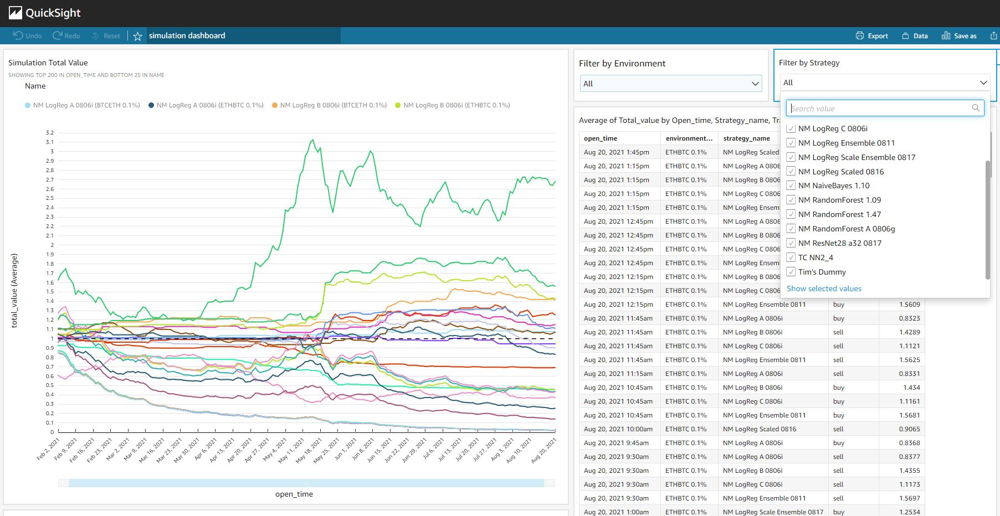

# Welcome

Hi, my name is Nicholas Miller and welcome to my github.io page.

## Links

- LinkedIn: [https://www.linkedin.com/in/nicholasmiller/](https://www.linkedin.com/in/nicholasmiller/)
- Github Profile: [https://github.com/cassova](https://github.com/cassova)

---

# Projects

#### Creating and Evaluating Successful Cryptocurrency Exchange Strategies

<table>
  <tr style="vertical-align:top"><td width="200">
    
  </td>
<td>
A deep dive into several different strategies that can be used to predict buy and sell opportunities for the exchanging of cryptocurrencies. Utilizes Amazon Web Service serverless architecture patterns to automate and scale the machine learning models in a production environment. Supports a variety of classifiers and regressors from scikit-learn, ensemble of models, as well as neural networks.
</td>
</table>

### Project 2
2

#### Project 3
3

##### Project 4
4
