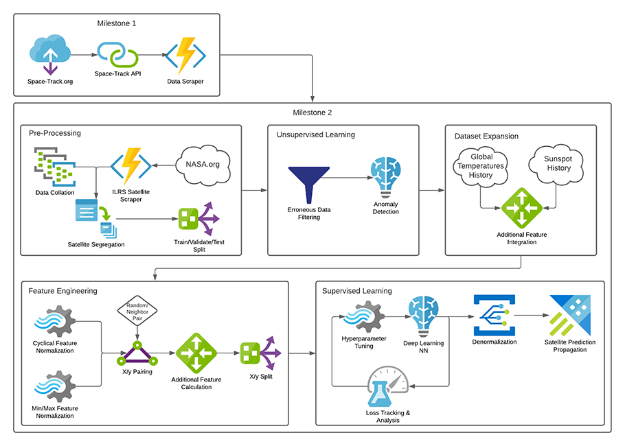

# Welcome

Hi, my name is Nicholas Miller and welcome to my github.io page.

- Github Profile: [https://github.com/cassova](https://github.com/cassova)
- LinkedIn Profile: [https://www.linkedin.com/in/nicholasmiller/](https://www.linkedin.com/in/nicholasmiller/)

---

# Projects

### Creating and Evaluating Successful Cryptocurrency Exchange Strategies

`AWS S3` `AWS EC2` `AWS RDS` `AWS Lambda` `AWS QuickSight` `AWS SQS` `AWS DataSync` `Binance` `Python 3.8` `Jupyter Notebook` `Pandas` `NumPy` `Scikit-learn` `PyTorch` `GPU` `ResNet28` `RandomForest` `GradientBoost` `XGBoost` `LogisticRegression` `Naive Bayes` `MLPClassifier` `mplfinance` `matplotlib` `zipline` `PostgreSQL` `Ensemble` `Cryptocurrency` `AdaBoost` `stat arb`

<table>
  <tr style="vertical-align:top"><td width="200">
    
  </td>
  <td>
A deep dive into several different strategies that can be used to predict buy and sell opportunities for the exchanging of cryptocurrencies. Utilizes Amazon Web Service serverless architecture patterns to automate and scale the machine learning models in a production environment. Supports a variety of classifiers and regressors from scikit-learn, ensemble of models, as well as neural networks.
  </td></tr>
  <tr><td colspan="2">
    

      <a href="https://mads-swaps.github.io/">White Paper</a> |
      <a href="https://github.com/mads-swaps/swap-for-profit">Github Repository</a>
    

  </td></tr>
</table>

### Improving Earth-orbiting object state prediction by using big data analysis and machine learning techniques on TLE data

`Python 3.8` `Jupyter Notebook` `Pandas` `NumPy` `Scikit-learn` `PyTorch` `GPU` `ResNet28` `ARIMA` `DBSCAN` `matplotlib` `multiprocessing` `multithreading` `Space-Track.org` `TLE` `anomaly detection` `deep neural network` `k-nearest neighbor` `ExtraTrees` `Linear Regression` `RandomForest` `GradientBoost` `MultiOutputRegression` `SVM` `sgp4` `Spark` `MRJob` `Hadoop`

<table>
  <tr style="vertical-align:top"><td width="200">
    
  </td>
  <td>
  Utilizing deep learning, and unsupervised learning on publicly available TLE data of Earth-orbiting objects to deliver superior orbit propagation results compared to the SGP4 standards.
  </td></tr>
  <tr><td colspan="2">
    

      <a href="https://cm-tle-pred.github.io/">White Paper</a> |
      <a href="https://github.com/cm-tle-pred/tle-prediction">Github Repository</a>
    

  </td></tr>
</table>

### Satellite congestion around Earth exploratory data analysis

`Python 3.8` `Jupyter Notebook` `Pandas` `NumPy` `Heroku` `Plotly` `Dash` `Flask` `CesiumJS` `Space-Track.org` `TLE` `CSS` `HTML` `matplotlib` `gabbard diagram` `sgp4` `skyfield` `mplot3d`

<table>
  <tr style="vertical-align:top"><td width="200">
    
    
  </td>
  <td>
Space, and more specifically low-earth orbit, is about to get a whole lot busier and this is making many concerned. At present, there are about 2,000 operational satellites in low-earth orbit and more than double that in defunct satellites. But last year in October, SpaceX requested permission to launch 30,000 Starlink satellites into low-earth orbit. This is in addition to the 12,000 that already received approval. These satellites have already begun interrupting astronomical observations, creating light pollution and increasing collision risks in an environment where a collision could trigger a chain reaction which not only endangers current and future satellites but also human lives.
  </td></tr>
  <tr><td colspan="2">
    

      <a href="https://mads-hatters.github.io/">White Paper</a> |
      <a href="https://github.com/mads-hatters/SIADS-591-Orbital-Congestion">Github Repository</a> |
      <a href="https://oc-dash.herokuapp.com/">Heroku Dashboard</a>
    

  </td></tr>
</table>

### Satellite CZML

`Python` `CesiumJS` `czml` `sgp4`

<table>
  <tr style="vertical-align:top"><td width="200">
    
  </td>
  <td>
A PyPi Package that creates a CZML string based on TLE (Two Line Element set) data for plotting satellites on the open source CesiumJS JavaScript library.  CesiumJS is a WebGL earth modeling engine which allows for time annimated displays of satellites using 3D and 2D interactive maps in the web browser. A CZML file/string is used by CesiumJS to show a time animation.
  </td></tr>
  <tr><td colspan="2">
    

      <a href="https://pypi.org/project/satellite-czml/">PyPi Package</a> |
      <a href="https://github.com/cassova/satellite-czml">Github Repository</a> |
      <a href="https://github.com/cassova/satellite-czml">Documentation</a>
    

  </td></tr>
</table>

### Faker Maker

`Python` `Pandas` `Faker`

<table>
  <tr style="vertical-align:top"><td width="200">
    
  </td>
  <td>
A PyPi Package that creates pandas dataframes filled with fake data from the Faker package using an IPython magic function with custom domain specific language.
  </td></tr>
  <tr><td colspan="2">
    

      <a href="https://pypi.org/project/fakermaker/">PyPi Package</a> |
      <a href="https://github.com/cassova/Faker-Maker">Github Repository</a> |
      <a href="https://github.com/cassova/Faker-Maker">Documentation</a>
    

  </td></tr>
</table>

### Dinosaur Puzzle Adventure Kids Game

`Unity 2019.4.4f1` `Android` `C#` `GCP` `Firebase` `Crashlytics` `Firestore` `Remote Config` `Voronoi diagram` `Even–odd rule`

<table>
  <tr style="vertical-align:top"><td width="200">
    
  </td>
  <td>
I created this game for my toddler who loves dinosaurs and puzzles but easily became bored with many apps. My toddler's feedback went into creating this unique experience and I hope your child will enjoy this game as much as mine.  </td></tr>
  <tr><td colspan="2">
    

      <a href="https://play.google.com/store/apps/details?id=com.KaitechyApps.DinoPuzzleApp">Google Play</a>
    

  </td></tr>
</table>
